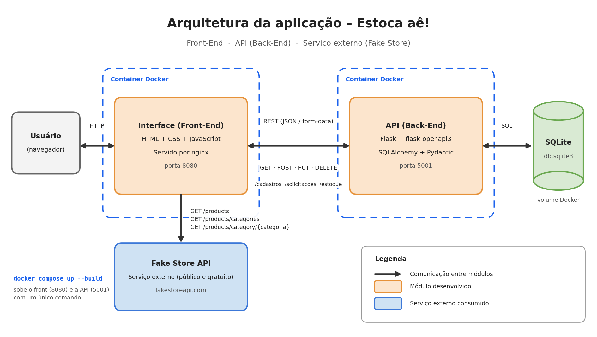

# estoca_ae_front
MVP para Pós PUC RIO - Engenharia de Software - Arquitetura de Software

# 📦 Estoca aê! - Gestão de Logística Inteligente

O **Estoca aê!** é uma interface web para gestão de materiais e controle de estoque. O sistema permite o cadastro de itens, gestão de solicitações e visualização de estoque em tempo real.
O usuário consulta um catálogo de referência (Fake Store API), cadastra materiais, faz solicitações, atende os pedidos e acompanha o estoque gerado. Os registros ficam guardados na API Estoca aê! (repositório separado), que armazena os dados em SQLite.

# Sumário

Arquitetura
Funcionalidades
Tecnologias
API externa: Fake Store API
Comunicação com a API Estoca aê!
Estrutura do projeto
Como executar
Repositórios do projeto

# Arquitetura



- O projeto segue o Cenário 1 proposto no enunciado do MVP:
- O front-end (este repositório) é servido por nginx na porta 8080.
- O front consulta o catálogo de produtos na Fake Store API (serviço externo).
- O front chama a API Estoca aê! (Flask, porta 5001) para cadastrar materiais, criar e atender solicitações e consultar o estoque.
- A API persiste os dados em SQLite, em um volume Docker.


## 🚀 Funcionalidades

* **Catálogo de referência:** lista os produtos da Fake Store, com filtro por categoria. O botão "Cadastrar" transforma o produto em um material.
* **Cadastro de Materiais:** cadastro manual (nome, valor e link da imagem), listagem com miniatura e exclusão.
* **Solicitação de material:** escolha do material, quantidade e data de necessidade. Acompanhamento das solicitações: status colorido (pendente ou atendida), com ações de atender e excluir.
* **Estoque:** ao atender uma solicitação, o item passa a aparecer no estoque, que também permite exclusão.


## 🛠️ Tecnologias Utilizadas

* **Interface:** HTML5, CSS3 e JavaScript (Fetch API)
* **Servidor web (container):** nginx
* **Containerização:** Docker e Docker Compose
* **Serviço externo:** Fake Store API
* **Back-end:** API Estoca aê! (Flask, repositório separado)


## 🛒 API externa: Fake Store API

O projeto utiliza a **Fake Store API** como catálogo externo de referência.

| Informação | Detalhes |
|---|---|
| **Descrição** | API REST pública que fornece um catálogo fictício de produtos, incluindo título, preço, categoria, descrição e imagem. |
| **URL base** | https://fakestoreapi.com |
| **Cadastro ou chave de acesso** | Não é necessário |
| **Custo** | Gratuita |
| **Licença de uso** | *Confirmar no repositório oficial do projeto.* |


### 📡 Rotas utilizadas

| Método | Rota | Uso no projeto |
|:---:|---|---|
| `GET` | `/products` | Lista os produtos do catálogo |
| `GET` | `/products/categories` | Preenche o filtro de categorias |
| `GET` | `/products/category/{categoria}` | Lista os produtos de uma categoria |

Os dados são consumidos e tratados dentro da própria aplicação, sem redirecionar o usuário para outro site.

Cada produto escolhido no catálogo é cadastrado na API **Estoca aê!** com o seguinte mapeamento:

| Fake Store API | Material cadastrado |
|---|---|
| `title` | `nome` |
| `price` | `valor` |
| `image` | `link` — exibido como miniatura |

> 💡 **Observação:** A Fake Store API não define a moeda dos preços. No sistema, o valor é tratado como valor de referência. As operações de escrita da Fake Store não gravam dados de verdade; por isso, a persistência é realizada pela API **Estoca aê!**.


## 🔗 Comunicação com a API Estoca aê!

O endereço da API está definido na primeira linha do `script.js`, através da variável `baseUrl`:

```javascript
const baseUrl = 'http://127.0.0.1:5001';

|  Método  | Rota                         | Uso no front-end                                       |
| :------: | ---------------------------- | ------------------------------------------------------ |
|   `GET`  | `/cadastros`                 | Lista os materiais e preenche o seletor de solicitação |
|  `POST`  | `/cadastros`                 | Cadastra um material pelo formulário ou catálogo       |
| `DELETE` | `/cadastros/{id}`            | Remove um material                                     |
|  `POST`  | `/solicitacoes`              | Cria uma solicitação                                   |
|   `GET`  | `/solicitacoes`              | Lista as solicitações                                  |
|   `PUT`  | `/solicitacoes/{id}/atender` | Atende a solicitação e gera o estoque                  |
| `DELETE` | `/solicitacoes/{id}`         | Remove uma solicitação pendente                        |
|   `GET`  | `/estoque`                   | Lista os itens em estoque                              |
| `DELETE` | `/estoque/{id}`              | Remove um item do estoque                              |

📌 Os envios POST utilizam FormData.


## 📁 Estrutura do projeto

├── docs/
│   └── arquitetura.png       # Fluxograma da arquitetura
│
├── index.html                # Estrutura da página
├── script.js                 # Lógica e chamadas às APIs
├── style.css                 # Estilos da aplicação
├── favicon.png               # Ícone da aplicação
├── painel.png                # Imagem do cabeçalho
│
├── Dockerfile                # Imagem do front-end com Nginx
├── docker-compose.yml        # Execução integrada do front e da API
└── README.md                 # Documentação do projeto


## 🚀 Como executar
🐳 Opção 1 — Docker Compose
Pré-requisitos
Docker instalado e em execução.
Repositórios do front-end e da API clonados lado a lado.

📂 Estrutura esperada
projetos/
│
├── estoca_ae-api-full-stack-avancado/
│   └── API
│
└── estoca_ae-front-full-stack-avancado/
    └── Front-end

1. Clone os repositórios
git clone https://github.com/kathleenborges/estoca_ae-api-full-stack-avancado.git
git clone https://github.com/kathleenborges/estoca_ae-front-full-stack-avancado.git

2. Entre na pasta do front-end
cd estoca_ae-front-full-stack-avancado

3. Suba os serviços
docker compose up --build

4. Acesse a aplicação
Serviço	Endereço
🌐 Front-end	http://localhost:8080
🔧 API / Swagger	http://localhost:5001/openapi

5. Para parar a aplicação
Pressione:
Ctrl + C
Depois execute:
docker compose down
Os dados da API ficam armazenados no volume estoca_dados e permanecem entre as execuções.
Para remover também os dados persistidos:
docker compose down -v


## 🔗 Repositórios do projeto
Componente	Repositório
🌐 Front-end	estoca_ae-front-full-stack-avancado
🔧 API / Back-end	estoca_ae-api-full-stack-avancado

---
Desenvolvido por Kathleen Borges com foco em otimização de processos. 🤖📦
